# Andrew Koulogeorge | Robot Planning

# 2R, 3R, and 4R Planar Robot Motion Planning
## Kinematics Simulator and Visualization
See the Kinematics.py file! First, given a list of angles representing the rotation of each arm with the horizontal, we want to compute the endpoints of the links. The location of the $i$ th point can be computed as a function of the $i-1$th point along with the sum of the first $i-1$ angles using basic trigonometry laws. Given these end points, we use drawing.py to visualize what the robot arm looks like. Matplotlib is super helpful for this! I used the Shapely library to create shape objects. Given the endpoints of the arms configuration and the shapes in the physical space we are trying to avoid, we draw all on the physical plane. If there is an intersection between any of the robot arm segments and any of the shapes, we draw the screen a light red!

## Obstacles and Collision Detection
Within Kinematics, we create a method which creates the objects the robot arm will have to move around. I created a few helper function to transform the robot endpoints and obstacles into Shapely objects. Then, I used some built in helper functions to determind if a line segment is intersecting with a polygon. I used a combination of the .intersects() and .touches() method to create the functionality where an intersection is counted when the line segment hits the interior of the shape but does not count if we are only touching the boundary! The output of the collision detecter helper function can then be fed into the visualization helper function and will print the screen red! 

## Probabilistic Roadmap Overview
Given a starting and goal configuration of the robot, we wish to find a path in the C space from the start location to the end location without hitting an obstacle. There are $2$ main steps in this algorithm: constructing a discrete representation of the search space for the robot to explore and then actually exploring that search space to find the shortest path. We store the graph explicitly in memory as an adjacency list and compute the objects in the robots path before hand to reuse during the algorithm. 

- Sampling Points: We will construct the graph of the continuous c space by sampling points in the space and constructing the graph overtime by connecting these randomly sampled points. For each point we sample in the space, we randomly generate $R$ values between $0$ and $2\pi$. Given this location in the c space, we need to first identify if the point is intersecting with a physical object. We use the compute_endpoints() function from Kinematics.py to compute the robotic arm location in the physical space and then use collision() to see if the configuration is legal given the shapes we are trying to avoid. If this is a legal point, we add the location node to our graph.   

- Constructing Edges: After sampling the nodes of our graph, we loop over each of the nodes and consider all other nodes (expensive step!). For each pair of nodes, we compute the distance between these two points in the c space. This step is tricky for a couple of reasons. First, its not obvious the meaning that the L2 distance has within the c space. Second, we need to make sure that we take care of the fact the the c space itself is not locally $R^2$ but in fact it is a torus so the shortest path between two paths must also consider the path going around the torus! I handle this case by taking the shorter distance between the two directions that each cordinate in the c space could take, and then considered the L2 distance between each of these paths. I drew a picture of a torus embedded in the plane, where we think about the walls and the ceilings of the box as being like packman and you can go right and end up all the way on the left (same for up and down). This way, we are still computing the L2 norm in the torus space, we are just choosing the best way to go for each dimention of the space. This is simple to see in the $1D$ case when we can either go left or right between $2$ points on the torus. When we imagine the $2$D case, we can either wrap around on the top/bottom or left/right. For each component of the points in c space, we determind which way along the torus is the shortest. I computed this by considering each component and taking the min of each of these $2$ options. Note how I am, in a way, taking a slice of the torus along each of its components and considering if the shortest path is going left or right. This is like reducing each of the components into the $1D$ case! 

We also need to think about the legality of the connections we are making in the c space. The topology of our c space is extremely unknown. Just because we have two points in out c space that are not intersecting with any objects in the physical space, how can we know that no point exist on the line in c space between the two points we know are legal? Well, we cant. Or at least we didnt learn anything in this class about how to. So, we are just gonna throw some hacky method at it and it will work, most of the time. This method is taking the midpoint of the two points we know are valid and checking if the midpoint is a legal config in the physical space. If it is, then we will create an edge. If not, we move onto the next point. A more robust method would be to check k points along the line segment in the c space and make sure that none of them are intersecting with an object. I added this functionality in as well. We pick Z to be our parameter of how many points we are going to check along a line in C space. If any of these poitns are illegal, then we dnt add the point into the C space. I made this addition because when we get to higher dimention examples, more and more of the points along the c space lines are not legal. Keep in mind that there is a performance tradeoff when doing this check because we have to use the code in kinematics to go and check in the physical space if there is a collision.

- Including Query: After we have constructed the main graph, we include the start and goal node connections. I found to have more sucsess if we make the k nearest neighborhood of the start and goal space more dense. This enables us to have a greater chance of finding the goal state! This does not expose us to more risk (at least, not that much more) of getting an incorrect solution by connecting to an illegal edge in the c space because the graph at this point has so many nodes because we have already sampled all of them! Thus, there should be lots of nodes in the area to connect to which are legal that do not contain an illegal point inbetween!

- Uniform Cost Search: Once we have constructed the graph explicitly and stored it in memory, we can throw one of our search algorithms which we know very well at the graph to look for the goal configuration. As is standard, I included a backtracking algorithm to compute the most likley path once we have reached the goal state!

Another thing to note is the value of epsilon as the dimension of our c space increases. Since there will be more dims used to compute the distance between two points in higher dimentions, we increase the value of epsilon as our DoF goes up. Convergence is harder to achive if we do not do this.


## Testing 
Dear grader- I know that the homework assignment said that having a lot of small disks would be a great example. I found it such a pain in the neck to place all of the small shapes onto the screen manuelly and I am trying to finish this to work on my other finals :(. As a result, I tried to show the correctness of my algorithm and come up with some good examples even without having a bunch of shapes. 

See the main method in PRM to run these test cases! Additionally, I have also included the code I wrote to test each of the individual components

Example with $2$ degrees of freedom:

Note how the first node in the path is the starting node and the final node is within epsilon of the goal node. The correctness of our algorithm is shown by the graphic below which displays all of the different configurations the robot took in order to get within epsilon of the goal state. The different colors of the arm show different configuratons! Its good to see that not only did our robotic arm plan its way through the c space to the solution, but also that each congifuration between the start and the goal state is legal and is not intersecting with any of the obstacles! This indicates that our algorithm is correctly constructing legal edges in the c space!

Now, lets look at how the output of our algorithm changes as a function of the k. Recall that k is the number of connections that each node makes with the k nearest other nodes. num samples is how many nodes we draw from the space. epsilon is the distance we need to be to the goal in order to consider it a goal state.

```text
R = 2
k=5
num_samples=10000
epsilon = 0.1
```
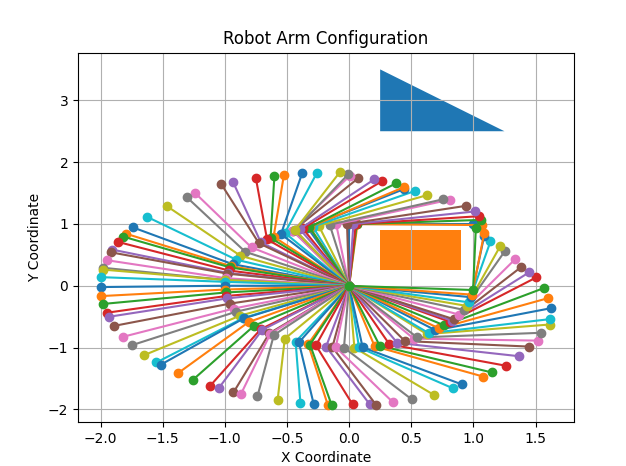

```text
R = 2
k=10
num_samples=10000
epsilon = 0.1
```
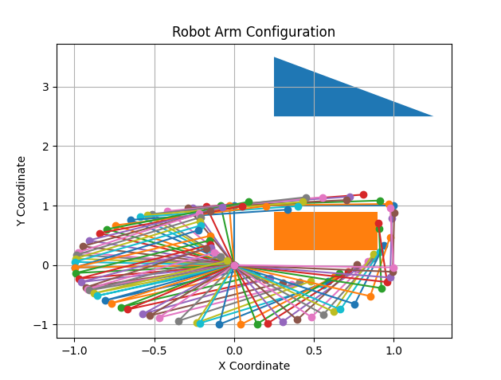

```text
R = 2
k=25
num_samples=10000
epsilon = 0.1
```
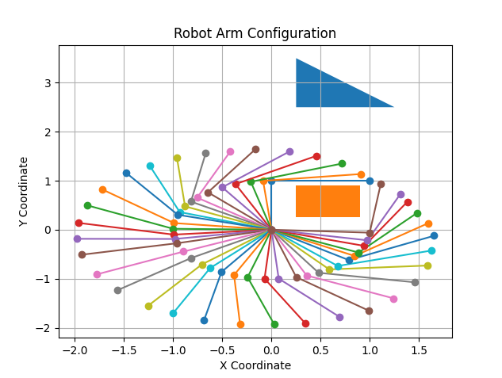

```text
R = 2
k=100
num_samples=10000
epsilon = 0.1
```
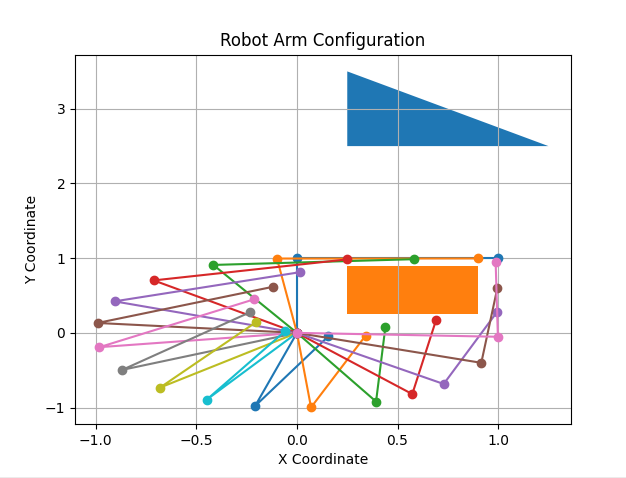

```text
R = 2
k=250
num_samples=10000
epsilon = 0.1
```
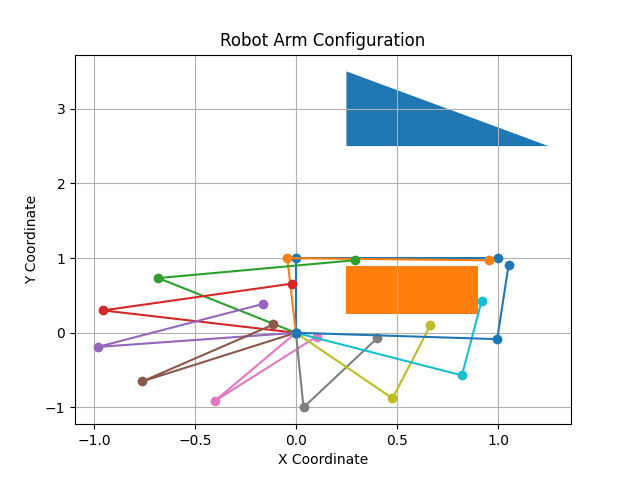

As we can see above, as we increase k each of the nodes we sample in our graph try and make connections with more and more nodes. As k increases, the robustness of our c space point validity checker gets put into question. When k is small, the graph is much more sparse and we have more confidense in each of the edges in our c space graph being valid. As k gets larger, we see that the robot starts to make jumps between configurations that may not be valid in the physical space. Our mid point checker is limited! In the example where k=250, it appears that the robot does not get to the goal state without going through an obstacle. Where as when k=5 or k=10, the motion of the robot is very robust.

Example with $3$ degrees of freedom. Note how we increase epsilon to be larger as the dimention of our c space increases because we have more dimentions to consider when looking at distance between $2$ points.

```text
R = 3
k=5
num_samples=10000
epsilon = 0.3
```
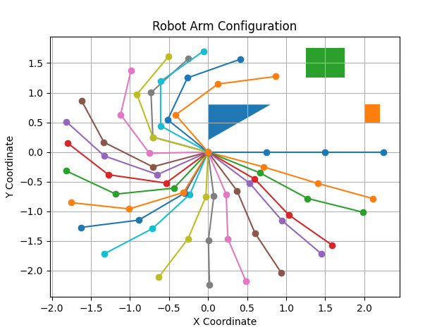

```text
R = 3
k=10
num_samples=10000
epsilon = 0.3
```
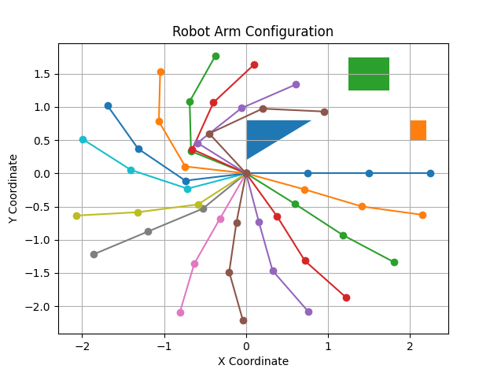

```text
R = 3
k=25
num_samples=10000
epsilon = 0.3
```
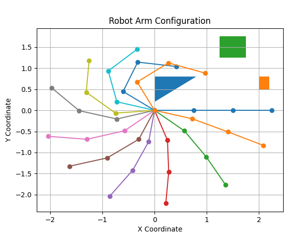

```text
R = 3
k=100
num_samples=10000
epsilon = 0.3
```
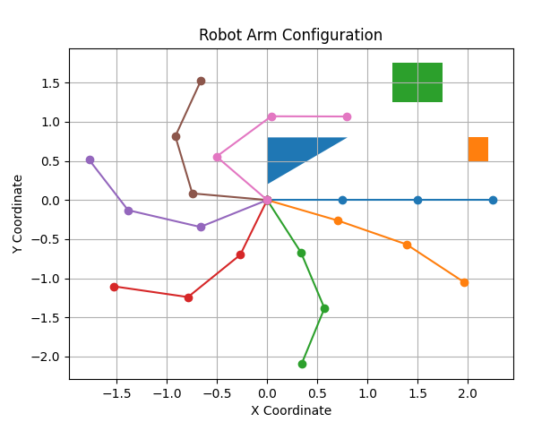

```text
R = 3
k=250
num_samples=10000
epsilon = 0.3
```
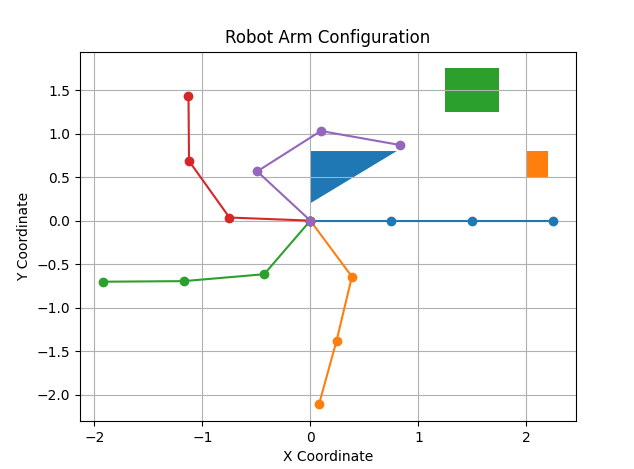

We see a very similar pattern with the DoF of $3$ as we did with $2$. One thing that is interesting to note is that the number of nodes on the shorest path to the goal state in the higher dim space seems to be shorter. This could be because the space got more complex yet we sampled the same amont of points.

Example with $4$ degrees of freedom:

```text
R = 4
k=5
num_samples=10000
epsilon = 0.5
```
No Path was found!

```text
R = 4
k=10
num_samples=10000
epsilon = 0.5
```
No Path was found!

```text
R = 4
k=25
num_samples=10000
epsilon = 0.5
```
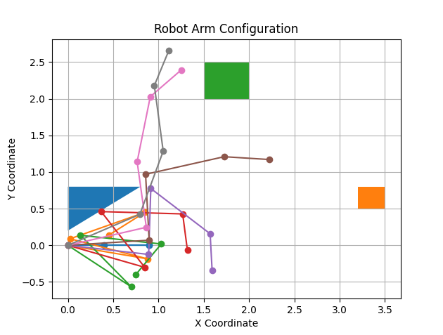

```text
R = 4
k=100
num_samples=10000
epsilon = 0.5
```
No Path was found!

```text
R = 4
k=250
num_samples=10000
epsilon = 0.5
```
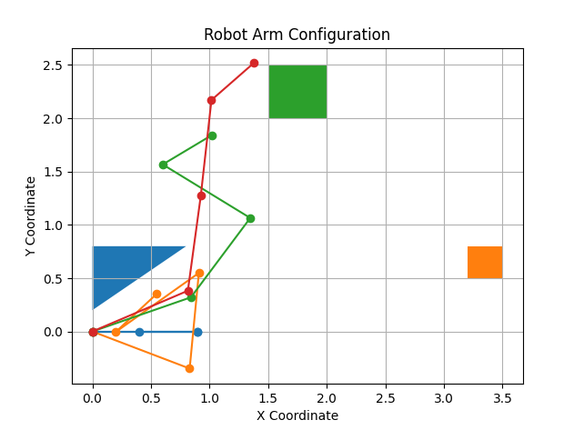


We can see that once we have gotten into the c space with dim $4$, the current number of points does not seem to be sufficent in finding a good solution. Only $2$ of these cases actually generated a path, and I beleive that both of these solutions are invalid and infact move through objects in the physical space. Another thing to note is how many more illegal connections are found when we get to $4$ DoF. This implies that our heuristic L2 distance metric and midpoint rule gets worst as the space gets more complex. Another extension idea would be to come up with a more robust to check if an edge is legal such as generating more than just the mid point and instead generating k points along the line in the c space between two edges. This way, if any of the points along the line were illegal, then we would not consider the point.

 Lets try some example where we increase the number of samples that we draw (this is going to make the algo very slow, but more on how to fix that later!)

```text
R = 4
k=10
num_samples=25000
epsilon = 0.5
```
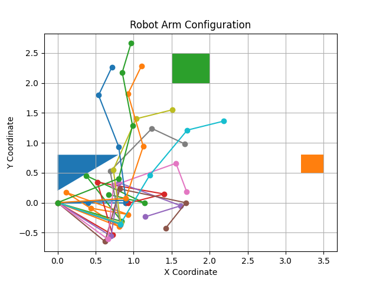

# Approximate-Nearest-Neighbor Algorithm (Extension)
One problem I ran into while testing this algorithm is when you try and increase the number of points in your space, the algo gets super slow, super quickly. Why is this? It is because of the O(n^2) complexity associated with creating the edges in the graph. For each point we sample ($n$) we loop over every single other points ($n-1$) and do computation to check if there is a legal edge between them. We wish to make this computation faster so that we can sample more points in our c space. As we saw when the dim of the c space got to be $4$, the performance of the search can be greatly increased if we sample more points!

We will try and create a data structure where we can do a query for neatest points in $log(n)$ time. But how?

Consider any high dimentional dataset. In our case, we have a large dataset of points in the c space which is relativly low dim compared to other machine learning problems. We will achive this $log(n)$ query time by creating a tree. We will construct the tree in the following way. At the beggining, pick any $2$ points in the space and create a hyperplane that is the perpendicular bisector to both points. At this point, the space will be divided into $2$ and the split occured on those two points. Then, we follow a recursive rule where we apply the same logic on the two spaces that were created from the following break. If we applied this algorithm on a dataset where we set the depth of our recursive tree to be $X$, then we would get $2^X$ leaves where each leaf is a region in our high-dim space that has been created from the repeated division by a hyperplane. Another way to parameterize the algorithm is to keep dividing a region in half so long as there are larger than $y$ data points in that region.

Another nice property that this tree has is that if $2$ points in the space are close to eachother, its more likley they will be close to eachother in the tree. So when we are looking for a point in the space, all we have to do is traverse this binary tree. Each node in the tree represents the choice of being on one side or the other of a hyperplane with cuts through the high dim space. 

What are some problems with this method? Well the first thought is that what if the point we are searching for is right on a boundary, and there are a lot of its closest neighbors that are on the otherside of that boundary? One solution would be to not just search the "correct" path according to the split but instead go down both paths depending on how close our target point is to the hyerplane we are splitting on. Another solution would be to create a forest of search trees- instead of divding up the space only once we could do it several times. Observe that the quality of a partition of our space is a function of the query we are looking for. If the point we pick is on several boundaries, then we are not in great shape. If its farther away from boundaries, then we are going to be able to create a cleaner neighborhood. Thus, the solution idea is to store each of the space partition trees into a priority queue and search all of the trees at the same time. After searching all the trees, we can take the union of all the points we found to come up with a more noise resistant neighborhood.

For implementation, I used the library annoy which uses C++ in the backround to crank super fast implementation of this algorithm. See the KNN_tester file for me making sure I was able to create the functionality I wanted with a tester dataset of the same form as the c space. I added a variable nn that can turn the KNN functionality on and off at execution time. The speed increase for this is crazy good! I used the time module in python to record how much improvment the algorithm saw. 

In the case when $R=2$, I was able to run an example with num_samples= 200,000 in 24.959478855133057 seconds. The robots is able to take many more steps:
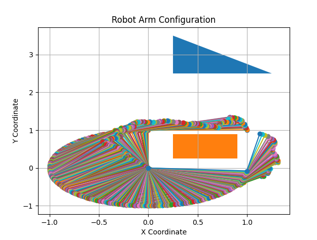

In the case when $R=3$, I was able to run an example with $100,000$ examples in 2.5 min:

 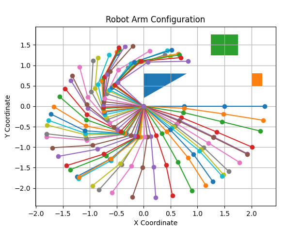

 Sadly, I was not able to get boosted performance for the 4D case. Another great extension idea would be to construct edges that are farther away from eachother in the search space based on arguments grounded in the relationship between the distance in the work space and the distance in the c space. This way, we would be able to know for certain that there is no obstacle in an area around our point in the c space. This would allow us to make connects with nodes which are farther away.

# Multi-Tree Guided Efficient Robot Motion Planning - Lit Review (Extension)

See here for paper! [https://arxiv.org/pdf/2205.04847.pdf]

Rapidly-exploring Random Tree (RRT) are widespread in solving the robot motion planning problem because of how quickly they can search a c space. More advanced implementations of the RRT include additional heuristic constrains to guide the tree search towards the goal state along with the geometric constraints imposed by the obstacles in the physical space. In practice, when these constraints are imposed onto the algorithm it makes it perform poorly when coupled with a high dimentional and complex c space. This motivates the need for a new algorithm which can search these highly constrained spaces more quickly. This motivation was also seen in class when Devin showed how these algorithms perform very poorly on the "Long Hallway" search space in which there is a unique thin area which connects the start and the goal states. The problem with the current methods (PRM, RRT) is that they sometimes fail to sample from the area which is needed to connect the start and the goal. In the cases when they do not fail, they do so sub-optimally.

Thus, the authors of this paper propose a novel algorithm called Multi-Tree RRT. The main idea is to use several trees to guide the search towards the goal. It borrows an idea from Reinforcment Learning which considers the tradeoff between exploration and exploitation, in which an AI agent is given the tradeoff between continuing to gain reward based on there current state or not gaining reward and searching for a another start with larger reward. In this senario, the exploration would be using the heuristic trees which are searching the space and which inform the rooted tree where as exploitation is the rooted tree attempting to connect directly to the goal. Recall earlier in the term when we learned about bi-directional search. In that algorithm, the idea is to cut your run-time complexity by simultaneously searching from both the goal and the start state. This is very effective in search spaces like the Long Hallways since it does not require the search from the start to travel down the long and isolated road to the goal. It gets help from the search backtracking from the goal!

 Multi-Tree RRT is a generalization of that idea of bi-directional search. The algorithm starts with both the rooted tree as well as a set of other expanding trees in the c space. When the rooted tree and the heuristic tree get close enough together, is able to use the information from the heuristic tree its close to and expand more intellegently towards the goal. The way in which the root tree and another heuristic tree are combined is by using a Guassian Mixture Model. See the graphic below!

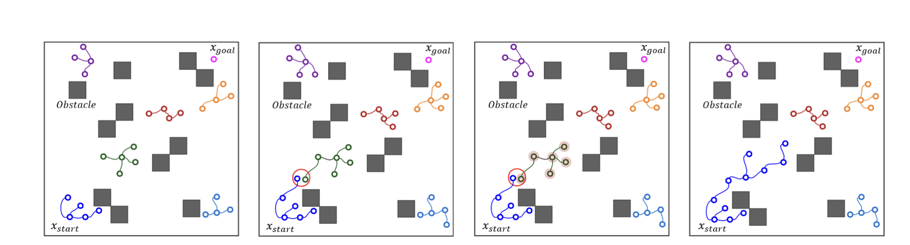

When MT RTT was tested against the other state of the art robot motion planning algorithms, it significantly outperformed RTT and B2U-RRT in terms of run time, length of trajectory to the goal state, and the number of invalid connections made in the c space!

Overview of Assignment Extensions:
- More robust c space legality point checker (interpolating along z points on the line)
- ANN Algorithm Analysis, Motivation & Implementation
- Lit Review